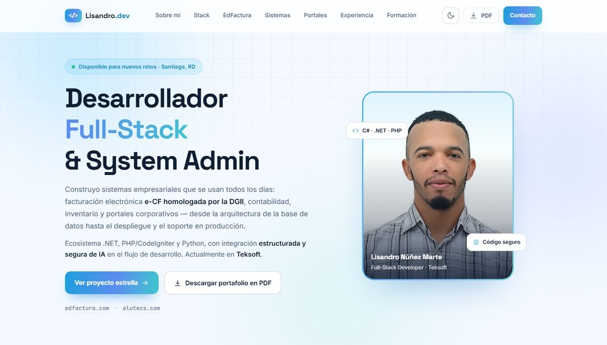

# Lisandro Antonio Núñez Marte

**Desarrollador Full-Stack & System Administrator** · Santiago, República Dominicana

Construyo sistemas empresariales que se usan todos los días: facturación electrónica **e-CF
homologada por la DGII**, contabilidad, inventario, CRM y portales corporativos — desde la
arquitectura de la base de datos hasta el despliegue y el soporte en producción.

Actualmente trabajo en una empresa **Privada**. En paralelo diseño y opero mis propios productos: **EdFactura** y
**Alutecs Services**.

### 🌐 [lisandronunez.github.io](https://lisandronunez.github.io/)

---

## Qué construyo

**[EdFactura](https://edfactura.com)** — Plataforma de facturación electrónica con comprobantes
fiscales (e-CF) homologados por la DGII, contabilidad, inventario y gestión multiempresa.

**CashFlow** — Control de caja y flujo de efectivo para punto de venta: sesiones por cajero, corte
parcial, cierre de caja, caja chica y gastos fijos.

**EDLawOffice** — Gestión para oficinas de abogados: expedientes y casos, clientes, agenda de
audiencias, documentos y honorarios.

**Surek CRM** — CRM para corredora de seguros, con portales diferenciados para socios, clínicas y
clientes.

Y **10 portales corporativos** desarrollados a través de [Alutecs Services](https://alutecs.com):
periódicos digitales, retail, turismo, inmobiliaria, consultoría, servicios, distribución y firmas
legales.

En el portafolio está cada proyecto con su detalle, mi experiencia, formación y el CV descargable
en PDF.

---

## Contacto

La información de contacto está en el sitio, tras el botón *Ver información de contacto*.

[edfactura.com](https://edfactura.com) · [alutecs.com](https://alutecs.com)
